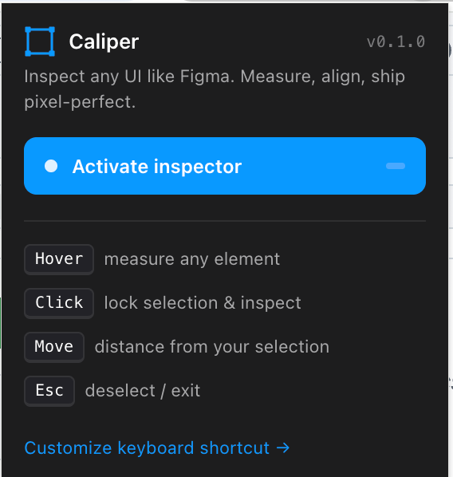

# Caliper — Figma-style web UI inspector

> Hover any element to measure it. Click to inspect every CSS property in one panel. Move the cursor to see the distance between two elements drawn live in red — no DevTools, no guesswork.


Caliper is a cross-browser web extension that turns any page into a Figma-style inspect surface. It exists because shipping pixel-perfect implementations against a Figma mockup means flipping between Figma, the browser and DevTools dozens of times per session — measuring padding, comparing font sizes, eyeballing distances. Caliper collapses that loop into hover-and-click.

Built for **frontend developers**, **UX/UI designers**, and **QA engineers** who want a CSS inspector that thinks like a design tool, not a debugger.

---

## Features

- **Hover any element** — outline + dimension pill (`width × height`) instantly.
- **Click to lock a selection** — opens a side panel grouping every relevant property:
  - **Layout** — W, H, X, Y (viewport-relative), Display, Gap.
  - **Spacing** — Padding & Margin, also visualised as colored layers on the page (green / orange, the DevTools convention designers already know).
  - **Typography** — font family, size, weight (with human-readable name), line height, letter spacing, color, text alignment.
  - **Fill** — background color with swatch + hex.
  - **Border** — width, style, color, radius.
  - **Effects** — box-shadow, opacity.
- **Move the cursor over another element** — distance between the selection and the hover is drawn in red on every axis. **No modifier key required.** Works for side-by-side gaps and for nested cases (the four padding-style insets between an outer and an inner element).
- **Click any panel row** — copies the value to the clipboard, with a "Copied" toast.
- **Smart breadcrumb** — picks `id`, then `data-testid`, then the first two CSS classes. Reads `button[data-testid="submit"]` instead of `button.bg-blue-500.text-white` in component-based codebases.
- **Works inside iframes** — content scripts run in every frame in the tab (top + same-origin + cross-origin), so embedded widgets are inspectable too.
- **Esc cleans up everywhere** — pressed in any frame, the inspector deactivates across the whole tab via the service worker.
- **Keyboard shortcut** — `⌘/Ctrl + Shift + U`, customisable.
- **Zero build step** — vanilla JavaScript, plain files, just load the folder.

The whole UI lives in a closed Shadow DOM attached to `<html>`, so the page's CSS can never leak in and our styles can never leak out.

---

## Why this exists

DevTools is great when you already know what you're looking for. It's slow when the question is *"is this 16px or 24px? is this aligned to the grid? is the gap between these two cards what the design says?"* — questions designers and frontend developers ask hundreds of times during implementation review.

A typical pixel-perfect QA loop in vanilla DevTools:

1. `⌘⌥I` to open DevTools.
2. Activate the inspector.
3. Click the element.
4. Scroll the Computed pane.
5. Find the property — possibly buried under cascading overrides.
6. Switch back to Figma.
7. Compare the two numbers.
8. Repeat for the next property.

Caliper: hover, click, read the panel. Done.

---

## Install

The same source folder loads into Chrome, Edge, Firefox and Safari. No build step, no per-browser variants.

### Chrome / Edge / Brave

1. Open `chrome://extensions/` (or `edge://extensions/`).
2. Enable **Developer mode** (top-right toggle).
3. Click **Load unpacked** and pick this folder.
4. Refresh any tab you had open before installing.

Customise the keyboard shortcut at `chrome://extensions/shortcuts`.

### Firefox 121+

Firefox 121 is the minimum because that release made MV3 service workers viable.

1. Open `about:debugging#/runtime/this-firefox`.
2. Click **Load Temporary Add-on…**.
3. Pick any file inside this folder (e.g. `manifest.json`).
4. The add-on stays loaded until you restart Firefox.

Customise the shortcut at `about:addons` → ⚙ → **Manage Extension Shortcuts**.

### Safari 16.4+

Apple ships every Safari extension inside a host app, so there is no "load unpacked" — but the conversion is one command:

```sh
xcrun safari-web-extension-converter /path/to/caliper
```

That generates an Xcode project. Build & run it once (⌘R), then in Safari → Settings → **Extensions** → enable **Caliper**. For unsigned development builds, also enable Safari → Develop → **Allow Unsigned Extensions** (resets when you quit Safari unless you sign with an Apple Developer ID).

Note: Safari often ignores manifest-declared keyboard shortcuts. Use the toolbar icon, or assign one in System Settings → Keyboard → Keyboard Shortcuts → App Shortcuts.

---

## How to use

<p align="left">
  
</p>

1. Click the Caliper icon in the toolbar, or press the keyboard shortcut.
2. The page cursor switches to a crosshair and a blue dot appears on the toolbar badge.
3. **Hover** anything to see its size.
4. **Click** to lock it as the selection. The side panel opens at the top-right with every property grouped.
5. **Move the cursor** to another element — distance lines and value pills are drawn between the selection and whatever is under your cursor.
6. **Click a row** in the panel to copy the value.
7. **Esc** to deselect; **Esc** again to exit the inspector.

---

## How it compares

| Capability | Browser DevTools | PerfectPixel | VisBug | **Caliper** |
|---|---|---|---|---|
| Live measurements on hover | Computed styles only | — | Inline tooltips | **Yes — outline + dimension pill** |
| Distance between two elements | — | — | — | **Yes — drawn live, no Alt key** |
| Nested padding measurements | Box-model panel only | — | — | **Yes — Figma-style insets** |
| All-properties-in-one panel | Multiple tabs | — | — | **Yes — six grouped sections** |
| Click-to-copy values | — | — | — | **Yes** |
| Iframe support | Per-frame switching | — | — | **Yes — auto, every frame** |
| Source license | Browser-bundled | Limited | MIT | **PolyForm Noncommercial** |

Caliper is not a replacement for DevTools — keep DevTools for everything beyond visual inspection. It's the missing layer between Figma and DevTools for the moment when you're trying to ship the implementation that matches the mockup.

---

## Architecture

Single source folder. Every file is plain JavaScript or HTML; the manifest loads the content scripts in dependency order.

```
caliper/
├── manifest.json              MV3 manifest, browser_specific_settings.gecko for Firefox
├── LICENSE                    MIT
├── background/
│   └── service-worker.js      keyboard relay, badge state, global Esc broadcast
├── content/                   loaded into every frame in the tab
│   ├── state.js               window.__Caliper namespace (active / hovered / selected)
│   ├── utils.js               formatters, color parsers, breadcrumb, getBox()
│   ├── overlay.js             closed Shadow DOM, outlines, box-model, distance, insets
│   ├── panel.js               side panel + click-to-copy + toast
│   └── main.js                state machine, event capture, render loop
├── popup/                     toolbar popup with status + legend
└── icons/
    ├── icon-{16,32,48,128}.png
    └── generate.py            stdlib-only PNG generator
```

The whole UI renders inside a single `<style>` block injected into a closed Shadow DOM at activation time — so the page's CSS can never style our overlays and our overlays can never style the page. Cross-frame coordination uses the service worker as a relay: any frame's Esc sends `caliper/global-deactivate` to the service worker, which broadcasts `caliper/deactivate` to every frame in the tab.

To regenerate icons:

```sh
python3 icons/generate.py
```

---

## Keywords

Chrome extension · Firefox extension · Safari web extension · Figma DevTools alternative · pixel-perfect QA · CSS inspector · web design QA · UX inspection tool · padding margin measurement · element distance overlay · Manifest V3 · source-available · noncommercial · PolyForm Noncommercial

---

## Contributing

Issues and PRs welcome. The codebase is intentionally minimal — vanilla JS, no bundler, no transpiler. If a change requires build tooling, please open an issue first to discuss; the loadability of plain files is part of the value proposition.

When proposing UX changes, prefer iteration on `IDEA.md`'s decision log over rewriting from scratch, so the reasoning behind the current behaviour stays visible.

---

## Roadmap

- v0.5 — comparison against Figma frames via the Figma REST API.
- v0.6 — persistent selection across reloads (frame XPath cache).
- v0.7 — Mozilla Add-ons listing and Mac App Store package for Safari.

---

## License

[PolyForm Noncommercial 1.0.0](LICENSE) — © 2026 Caliper contributors.

Caliper is **source-available for noncommercial use**. You may use it, modify it, and share it (including modified versions) for personal, educational, research, hobbyist, or any noncommercial purpose. Use by charities, schools, public-research institutions, and government agencies is also permitted.

**Selling Caliper, or shipping it as part of a paid commercial product or service, is not permitted** under this license. If you'd like a commercial license, please open an issue.

> Note on terminology: by the strict OSI definition, "open source" forbids field-of-use restrictions, so a noncommercial-only license is technically *source-available* rather than *open source*. The source code is fully public, modifiable and forkable for the permitted purposes — just not sellable.

---

## Disclaimer

Caliper is a UI inspection tool intended for design QA, debugging and educational use on pages you own or have explicit permission to inspect. The authors and contributors do not endorse and are not responsible for any modification, redistribution or use of this software outside of that intent — including, without limitation, automated scraping, surveillance, security-bypass tooling or unauthorised inspection of third-party systems.

The software is provided "AS IS" under the PolyForm Noncommercial License with no warranty of any kind, express or implied. By using Caliper you accept full responsibility for how you use it.
